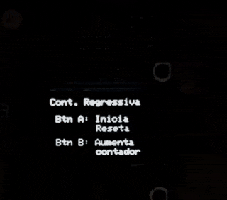

# Contador com Eventos IRQ

## 🎯 Objetivo do Projeto

Este projeto implementa um contador com tratamento de eventos por interrupções (IRQ) utilizando um microcontrolador RP2040 na placa BitDogLab. O sistema exibe os valores em um display OLED SSD1306 e responde a eventos através de botões. O Botão A inicia/reseta a contagem e o Botão B incrementa o valor.

## 🔧 Componentes Utilizados

- Placa BitDogLab com microcontrolador RP2040
- Display OLED SSD1306 (128x64 pixels)
- Botões para controle do contador

## 📌 Pinagem do Dispositivo

| Pino RP2040 | Função                    | Conexão                |
|-------------|---------------------------|------------------------|
| GPIO 5      | Botão de Inicio/Reset     | Pull-up interno        |
| GPIO 6      | Botão de Incremento       | Pull-up interno        |
| GPIO 14     | SDA (I2C)                 | Display OLED SSD1306   |
| GPIO 15     | SCL (I2C)                 | Display OLED SSD1306   |

## ⚙️ Como Compilar e Executar

### Pré-requisitos

- SDK do Raspberry Pi Pico instalado
- CMake 
- Compilador ARM GCC

### Compilação

1. Clone o repositório:
   ```bash
   git clone https://github.com/danlvr/danilo_oliveira_embarcatech_HBr_2025.git
   cd projetos/contador_dec_eventos_irq
   ```

2. Configure a variável de ambiente do SDK Pico (se ainda não estiver configurada):
   ```bash
   export PICO_SDK_PATH=/caminho/para/o/pico-sdk
   ```

3. Crie um diretório de build e compile:
   ```bash
   mkdir build
   cd build
   cmake ..
   make
   ```

4. O arquivo binário (UF2) será gerado na pasta `build`. 

### Execução

1. Conecte o BitDogLab ao computador em modo de programação (pressione o botão BOOTSEL enquanto conecta).
2. Copie o arquivo `.uf2` gerado para o drive que aparecerá no sistema.
3. O dispositivo irá reiniciar automaticamente e executar o programa.

## 📸 Demonstração do funcionamento



## 📊 Resultados Esperados/Observados

- Ao ligar o dispositivo, o display OLED mostrará a tela inicial com instruções.
- Ao pressionar o Botão A (GPIO5):
  - A contagem regressiva inicia em 9
  - O contador de eventos do Botão B é zerado
  - Os valores são exibidos no display OLED
- Durante a contagem regressiva (de 9 até 0):
  - O valor do contador diminui a cada segundo
  - O Botão B (GPIO6) pode ser pressionado para incrementar o contador de eventos
  - O display OLED atualiza em tempo real
- Quando o contador chega a 0:
  - O sistema "congela" e mostra o resultado final
  - O Botão B deixa de registrar pressionamentos
  - Apenas pressionando o Botão A novamente o sistema reinicia
- O sistema utiliza interrupções (IRQs) para detecção precisa dos pressionamentos de botão, mesmo durante operações de atualização do display.

## 🔍 Notas Técnicas

- O projeto implementa debouncing por software para evitar falsos acionamentos dos botões
- Utiliza flags e interrupções para garantir que os eventos dos botões sejam registrados com precisão
- Timer de 1 segundo implementado via API de repeating_timer do Pico SDK
- A atualização do display é feita no loop principal para evitar problemas de timing nas interrupções

## 📚 Bibliotecas Utilizadas

Este projeto utiliza a biblioteca pico-ssd1306, criada por David Schramm, para controle do display OLED:
- [pico-ssd1306](https://github.com/daschr/pico-ssd1306) - Biblioteca simples para utilização de displays SSD1306 com o Raspberry Pi Pico e o pico-sdk.

---

*Este projeto foi desenvolvido como parte do programa EmbarcaTech*
