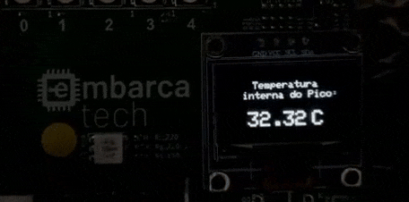

# Monitor de Temperatura Interna RP2040

## 🎯 Objetivo do Projeto

Este projeto utiliza o sensor de temperatura interno do microcontrolador RP2040 para monitorar a temperatura do chip. A leitura analógica é feita pelo ADC (Canal 4), convertida para graus Celsius (°C) usando a fórmula do datasheet do microcontrolador, e uma **média de 100 amostras** é aplicada para aumentar significativamente a estabilidade da leitura. O resultado é exibido em um **display OLED SSD1306** conectado via I2C, atualizado a cada segundo.

## 🔧 Componentes Utilizados

- Placa BitDogLab com microcontrolador RP2040
- Display OLED SSD1306 (128x64 pixels, interface I2C)

## 📌 Pinagem do Dispositivo

| Pino RP2040 | Função        | Conexão                | 
|-------------|---------------|------------------------|
| ADC 4       | Temp Sensor   | Conexão Interna        |
| GPIO 14     | SDA (I2C)     | Display OLED SSD1306   |
| GPIO 15     | SCL (I2C)     | Display OLED SSD1306   | 

## ⚙️ Como Compilar e Executar

### Pré-requisitos

- SDK do Raspberry Pi Pico instalado 
- CMake 
- Compilador ARM GCC

### Compilação

1. Clone o repositório:
   ```bash
   git clone https://github.com/danlvr/danilo_oliveira_embarcatech_HBr_2025.git
   cd projetos/pico_internal_temp
   ```

2. Configure a variável de ambiente do SDK Pico (se ainda não estiver configurada):
   ```bash
   export PICO_SDK_PATH=/caminho/para/o/pico-sdk
   ```

3. Crie um diretório de build e compile:
   ```bash
   mkdir build
   cd build
   cmake ..
   make
   ```

4. O arquivo binário (UF2) será gerado na pasta `build`. 

### Execução

1. Conecte o BitDogLab ao computador em modo de programação (pressione o botão BOOTSEL enquanto conecta).
2. Copie o arquivo `.uf2` gerado para o drive que aparecerá no sistema.
3. O dispositivo irá reiniciar automaticamente e executar o programa.

## 📸 Demonstração do funcionamento



## 📊 Resultados Esperados/Observados

- Ao ligar o dispositivo, o display OLED inicializa e começa a exibir a temperatura interna do chip RP2040 em graus Celsius
- A temperatura exibida deve refletir aproximadamente a temperatura ambiente somada ao calor gerado pelo próprio chip durante a operação.
- A leitura no display deve ser **relativamente estável** devido à implementação da **média de 100 amostras**, que suaviza ruídos do ADC e flutuações térmicas rápidas do die do processador.
- **Observação Importante:** Sem a técnica de média, observou-se experimentalmente uma **grande variação** nas leituras (ex: flutuações entre 28°C e 36°C em curtos períodos). Isso é atribuído principalmente ao **auto-aquecimento (self-heating)** cíclico do chip (causado pela alternância entre processamento/comunicação e períodos de espera) e também a ruído no ADC e/ou na tensão de referência (VREF). A **média de 100 amostras implementada mitiga significativamente este efeito**, resultando em leituras mais consistentes no display OLED.
- A precisão absoluta do sensor interno pode variar entre chips e não é garantida para aplicações de alta exatidão sem calibração específica por dispositivo.
- Os valores no display são atualizados a cada segundo (conforme `READ_DELAY_MS`).

## 🔍 Notas Técnicas

- O sensor de temperatura interno está conectado ao **Canal 4 do ADC** (`ADC_TEMP_SENSOR_CHANNEL`).
- A função `adc_set_temp_sensor_enabled(true)` é chamada para habilitar o sensor antes da leitura.
- A conversão de voltagem (obtida do valor raw do ADC) para Celsius utiliza a fórmula e constantes típicas encontradas no datasheet do RP2040: `Temp (°C) = 27 - (V_adc - 0.706) / 0.001721`.
- Para aumentar a estabilidade, o código implementa um loop que lê **100 amostras** do ADC em rápida sucessão e calcula a **média aritmética** antes de exibir o resultado no OLED.
- A comunicação com o display OLED SSD1306 é feita via I2C usando a API `hardware_i2c`.
- A leitura do ADC pode ser influenciada por ruído e pela estabilidade da tensão de referência (VREF), que por padrão é derivada da alimentação de 3.3V (AVDD). Flutuações nesta tensão podem afetar a leitura.
- A atualização do display envolve limpar o buffer, desenhar a string formatada com a temperatura média e enviar o buffer para o display físico.

## 📚 Bibliotecas Utilizadas

Este projeto utiliza a biblioteca pico-ssd1306, criada por David Schramm, para controle do display OLED:
- [pico-ssd1306](https://github.com/daschr/pico-ssd1306) - Biblioteca simples para utilização de displays SSD1306 com o Raspberry Pi Pico e o pico-sdk.

---

*Este projeto foi desenvolvido como parte do programa EmbarcaTech*