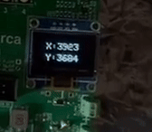

# Leitor de Joystick (ADC)

## 🎯 Objetivo do Projeto

Este projeto utiliza um microcontrolador RP2040 na placa BitDogLab para ler os eixos X e Y de um joystick analógico através de seus conversores Analógico-Digitais (ADC). O sistema implementa uma calibração por software para mapear a faixa de leitura real observada para a faixa ideal de 12 bits (0-4095). Os valores calibrados são então exibidos em tempo real em um display OLED SSD1306 conectado via I2C.

## 🔧 Componentes Utilizados

- Placa BitDogLab com microcontrolador RP2040
- Módulo Joystick Analógico (com potenciômetros para eixos X e Y)
- Display OLED SSD1306 (128x64 pixels, interface I2C)

## 📌 Pinagem do Dispositivo

| Pino RP2040 | Função       | Conexão                  | Observação     |
|-------------|--------------|--------------------------|----------------|
| GPIO 27     | ADC Input 1  | Eixo X Joystick (VRx)    | Canal ADC 1    |
| GPIO 26     | ADC Input 0  | Eixo Y Joystick (VRy)    | Canal ADC 0    |
| GPIO 14     | SDA (I2C)    | Display OLED SSD1306     |      -         |
| GPIO 15     | SCL (I2C)    | Display OLED SSD1306     |      -         |

## ⚙️ Como Compilar e Executar

### Pré-requisitos

- SDK do Raspberry Pi Pico instalado
- CMake 
- Compilador ARM GCC

### Compilação

1. Clone o repositório:
   ```bash
   git clone https://github.com/danlvr/danilo_oliveira_embarcatech_HBr_2025.git
   cd projetos/pico_joystick_adc
   ```

2. Configure a variável de ambiente do SDK Pico (se ainda não estiver configurada):
   ```bash
   export PICO_SDK_PATH=/caminho/para/o/pico-sdk
   ```

3. Crie um diretório de build e compile:
   ```bash
   mkdir build
   cd build
   cmake ..
   make
   ```

4. O arquivo binário (UF2) será gerado na pasta `build`. 

### Execução

1. Conecte o BitDogLab ao computador em modo de programação (pressione o botão BOOTSEL enquanto conecta).
2. Copie o arquivo `.uf2` gerado para o drive que aparecerá no sistema.
3. O dispositivo irá reiniciar automaticamente e executar o programa.

## 📸 Demonstração do funcionamento



## 📊 Resultados Esperados/Observados

- Ao ligar o dispositivo, o display OLED inicializa e começa a exibir os valores calibrados dos eixos X e Y.
- Os valores são precedidos pelas etiquetas "X:" e "Y:".
- Com o joystick no **centro**, os valores exibidos para X e Y devem ser próximos de **2048**. Pode haver uma pequena flutuação (ex: 2045-2055) devido a ruído ou pequenas imperfeições.
- Movendo o joystick completamente para a **esquerda** ou para **baixo**, os valores correspondentes devem se aproximar de **0**.
- Movendo o joystick completamente para a **direita** ou para **cima**, os valores correspondentes devem se aproximar de **4095**.
- Os valores no display são atualizados a cada `READ_DELAY_MS` milissegundos (100ms por padrão).
- Observou-se que as leituras *raw* (antes da calibração) não atingiam 0 ou 4095 e o centro não era exatamente 2048, necessitando da calibração implementada.
- Notou-se também uma ligeira diferença nos valores raw dependendo da fonte de alimentação (USB vs. Bateria), que é compensada pela calibração feita para a condição de operação principal.

## 🔍 Notas Técnicas

- O projeto utiliza a API `hardware_adc` do Pico SDK para ler os valores analógicos dos potenciômetros do joystick.
- **Calibração por Software:** Uma função `map_value` foi implementada para realizar um mapeamento linear entre a faixa de valores ADC *observada* (definida por constantes como `RAW_X_MIN`, `RAW_X_MAX`) e a faixa *desejada* (0 a 4095). Isso corrige tolerâncias dos componentes e variações na tensão de referência.
- Os valores MIN/MAX para calibração (`RAW_X_MIN`, etc.) podem precisar de ajuste fino dependendo do joystick específico e da fonte de alimentação predominante.

## 📚 Bibliotecas Utilizadas

Este projeto utiliza a biblioteca pico-ssd1306, criada por David Schramm, para controle do display OLED:
- [pico-ssd1306](https://github.com/daschr/pico-ssd1306) - Biblioteca simples para utilização de displays SSD1306 com o Raspberry Pi Pico e o pico-sdk.

---

*Este projeto foi desenvolvido como parte do programa EmbarcaTech*